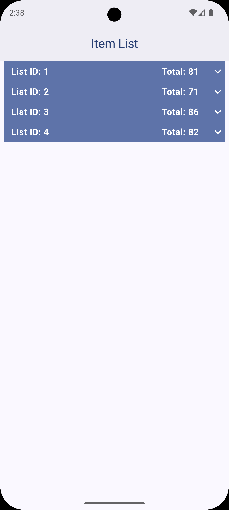
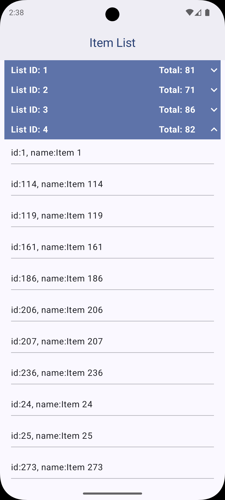
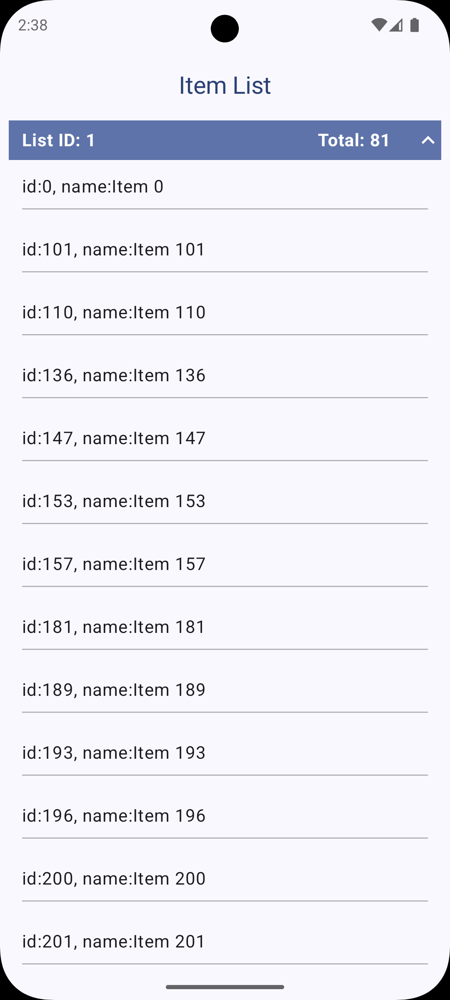

# Fetch Take-Home test
This is my solution for the fetch take-home test.
The app fetches a list of items from a remote Api, filters and sorts them and displays in group using sticky headers and expand/ collapse functionality.
 
## Features
- Fetch items from remote API
- Filter out items with null/blank names
- Sort by `listId`, then by `name`
- Display items grouped by `listId` using sticky headers
- Expand/collapse grouped sections on header click
- Beautiful UI with Jetpack Compose
- Unit tests for repository and view model

## Screenshots
   
 